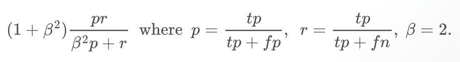
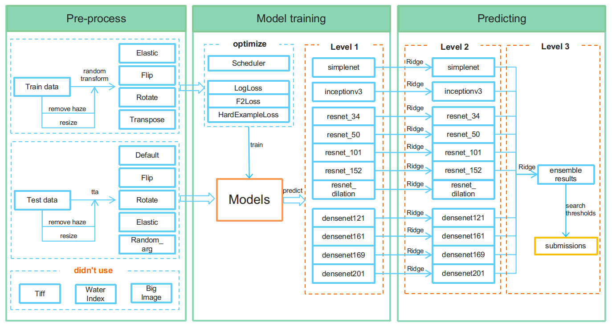

---
output:
  html_document:
    fig_caption: yes
  pdf_document:
    fig_caption: yes
---

### Task 3.A – Research: State of the art solutions (10 points)
**Data mining competition**: ["Planet: Understanding the Amazon from Space"](https://www.kaggle.com/c/planet-understanding-the-amazon-from-space), July 2017\
\
In this data mining competition, the participants were provided with a dataset consisting of over 40,000 satelite images. Each image had a resolution of 256 by 256 pixels, and covered an area of approximately 950 by 950 meters. The satelite images were captured above the Amazon in South-America. The goal of the competition was to successfully classify these satelite images. Each image could be classified into multiple classes:\
\
- **Atmospheric conditions**: clear, partly cloudy, cloudy, and haze\
- **Common land cover and land use types**: rainforest, agriculture, rivers, towns/cities, roads, cultivation, and bare ground\
- **Rare land cover and land use types**: slash and burn, selective logging, blooming, conventional mining, artisanal mining, and blow down\
\
The participants' model predictions were evaluated with their mean F2 score. This score determines the model prediction accuracy using the precision and recall measures. The formula of the score:\

\
The winner of the competition was a Kaggle user named ["bestfitting"](https://www.kaggle.com/bestfitting). He managed to win the competition by fine-tuning 11 convolutional neural networks (CNN's), and using these CNN's to build an ensemble model. This ensemble model was used to predict the final classes.\
\
The pre-processing step consisted of resizing the satelite images, removing haze from the images, and augmenting the data (e.g. flipping, rotating and transposing). Next, one *simplenet*, one *inceptionv3*, five *resnet* and four *densenet* CNN's were trained on the labeled training data. The resulting models were then ensembled by using a ridge regression model, allowing for the selection of the strongest models for each label prediciton.\
\
The main reasons why this model won the competition was the creation of an ensemble model. As different models had different capabilities on each class label, the combination of the models resulted in a higher accuracy.
\

\
**Figure 1.** Modeling workflow with pre-processing (left), model training (center)\ and predicting (right).
