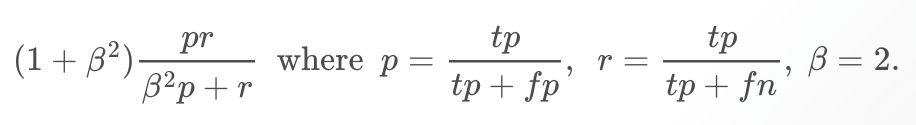

# Task 1: Explore a small dataset

## Basic classification/regression

In this task we decided to focus on classification models.
For experiments we will use *train* dataset from Kaggle's Titanic competition to have a better insight and background for Task 2. This dataset contains attributes like Survived, Name, Sex, Age, Ticket, Fare, Cabin and Embarked. We decided to use Survived attribute as a dependent value snice it indicates if passenger survived the sinking, which is quite interesting for prediction performance.

Basic classification was performed in RapidMiner using Cross Validation module.
For each experiment we will use the same setup.
Cross Validation was based on 10 folds and automatic sampling type.
Inside Cross Validation module we have two spaces to manage: training and testiong.
In training spae we placed classification model while in testing space we applied model with Performance analysis.

### Classification model: Decision Tree
For the first experiment we used Decision Tree model. We set parameters as follows: confidence = 0.25, minimal gain = 0.1.
Thanks to Performance module in Testing space we have a good insight into results of classification.
For such a setup we obtained following results: accuracy = 79,57%, precision = 77,04%, recall = 67,28%.

### Classification model: KNN
For the second experiment we used KNN (k-Nearest Neighbors) model. Parameters were set as follows: k = 1, measure types = MixedMEasures, mixed measure = MixedEuclideanDistance.
As a result of experiment we obtained: accuracy = 69,81%, precision = 59,78%, recall = 63,76%.

We can see that for this task Decision Tree model performed better in every aspect. KNN model usually performes better with numerics, while Decision Tree is good with both numerics and nominals. Decision Trees also deal with noisy or incomplete data.

# Task 2: Compete in a Kaggle Competition to Predict Titanic Survival

```{r, echo=FALSE}
library(knitr)
library(rpart)
train <- read.csv("train.csv")
test <- read.csv("test.csv")
test$Survived <- NA
data <- rbind(train, test)
```

The aim of the competition is to predict who among the passengers and crew was more likely to survive than others. Kaggle provides two datasets: *train* and *test*. While both datasets reference to passengers details, only *train* dataset contains infromation if passenger survived or not. Our goal is to predict which passenger from *test* dataset survived the sinking of Titanic.

## Preparation

For further processing we decided to combine both datasets into big one. Such an approach allows us to perform more adequate data analyse as we have a full insight of passengers.

## Data exploration

Whole dataned dataset contains 1309 records (passengers) with 12 variables.
In this part we will take a closer look to every attribute.

In datasets we can distinguish several (12) columns:

* Survived - indicates if given passenger survived
* PassengerId - passenger index in dataset
* Pclass - the ticket class (1,2,3)
* Name - full name of passenger, including their title
* Sex - sex of passenger (male or female)
* Age - age of passenger
* SibSp - number of siblings or spouses traveling with passenger
* Parch - number of parents or childern traveling with passenger
* Ticket - ticket number
* Fare - passenger fare
* Cabin - passenger's cabin number
* Embarked - port of embarkation (C = Cherbourg, Q - Queenstown, S = Southampton)

### Name
In given dataset we can see that *Name* attribute contains string with passenger's name, surname and title.

example: *Allison, Master. Hudson Trevor*

Fortunately, all rows in *Name* column follow the same string pattern (*surname*, *title* *first name*).
Thanks to this fact, we will be able to retrieve additional information about passengers, like common surnames or titles.

### Sex
According to data, there were 466 females and 843 males onboard. That gives us the first easy grouping of passengers. According to the rule "women and children first", Sex could be siginificant attribute in predictions.

### Age
Regarding Age attribute, we can see that this variable varies from 0.17 up to 80, with mean around 29.7. Age attribute can also be considered as significant factor. Do young people are more likely to survive?

## Feature Engineering
During feature engineering we are able to create additional columns with relevant variables that sould result in better prediciton accuracy.

### Feature: Title
As mentioned before, Name column contains not only name and surname of passenger but also a title (like Sir., Mr., Mrs., ...). 
Following common pattern (*surname*, *title* *first name*) we can retrieve additional Column in our dataset that would group our passenger by Title.
In addition, groups of unique similar titles were replaced by the tame variable (like 'Capt', 'Don', 'Major', 'Sir' => 'Sir').
```{r, echo=FALSE}
data$Name <- as.character(data$Name)
data$Title <- sapply(data$Name, FUN=function(x) {strsplit(x, split='[,.]')[[1]][2]})
data$Title <- sub(' ', '', data$Title)
data$Title[data$Title %in% c('Mme', 'Mlle')] <- 'Mlle'
data$Title[data$Title %in% c('Capt', 'Don', 'Major', 'Sir')] <- 'Sir'
data$Title[data$Title %in% c('Dona', 'Lady', 'the Countess', 'Jonkheer')] <- 'Lady'
data$Title <- factor(data$Title)
```

### Feature: Family
```{r, echo=FALSE}
data$FamilySize <- data$SibSp + data$Parch + 1
data$Surname <- sapply(data$Name, FUN=function(x) {strsplit(x, split='[,.]')[[1]][1]})
data$FamilyID <- paste(as.character(data$FamilySize), data$Surname, sep="")
data$FamilyID[data$FamilySize <= 2] <- 'Small'
data$FamilyID <- factor(data$FamilyID)
```
Basing on variables *SibSp* (number of siblings or spouses), *Parch*(number of parents or child) and Surnames retrieved from *Name* variable we are able to group passengers by families. Assuming that during disaster, every person takes care about their relatives, we think that it can be a significant factor in predicitons.

Our assumptions: 

* the number of relatives with who each passenger was traveling is aclculated as follows: *SibSp + Parch + 1* - result is family size
* if family size is less or equal 2 we assume that the value is not revelant and we mark sucha  afamily as *n/a*

As a result we obtained Family attribute with 97 levels.

### Feature: Deck
```{r, echo=FALSE}
data$Cabin <- as.character(data$Cabin)
data$Deck <- sapply(data$Cabin, FUN=function(x) {
    if(x == '') {
      'U'
    } else {
      substring(x, 1, 1)
    }
})
data$Deck <- factor(data$Deck)
```

Analysing *Cabin* attribute we figured out that each cabin number consists of Deck Level and Room number (like C40 => Deck C, Room 40).
Because Deck Level could play important role in evacuation, we assumed thet it's a siginicant attribute.
We decided to create a new attribute called Deck and we assigned relevant Deck Level to each passenger.
Unfortunately, not every passenger had a Cabin number assigned, in such a case we marked Deck as 'U'.

### Feature: TicketType
```{r, echo=FALSE,include=FALSE}
data$Ticket <- as.character(data$Ticket)
data$TicketType <- sapply(data$Ticket, FUN=function(x) {
  temp = strsplit(x, split=' ')[[1]][1]
  if(is.na(as.numeric(temp))) {
    temp
  } else {
    'num'
  }
})
data$TicketType <- factor(data$TicketType)
```

Looking into ticket numbers we can see that some tickets have common prefix that could refer to Ticket Type of place of purchase (example: STON/02 42342).
We decided to retrieve that ticket prefix and create a new attribute for each passenger.
If ticket didn't have any prefix, we marked TicketType as 'num'.

As a result we obtained TicketType factor with 51 levels.

### Missing values

```{r, echo=FALSE}
Agefit <- rpart(Age ~ Pclass + Sex + SibSp + Parch + Fare + Embarked + Title + FamilySize, 
                data=data[!is.na(data$Age),], method="anova")
data$Age[is.na(data$Age)] <- predict(Agefit, data[is.na(data$Age),])
data$Embarked[c(62,830)] = "S"
data$Embarked <- factor(data$Embarked)
data$Fare[1044] <- median(data$Fare, na.rm=TRUE)
```

We have found that some records lack in Age attribute. In such a situationw e decided to use a Decision tree to predict missing Age values.
As siginicant factors we marked attributes: Pclass, Sex, FamilySize, Embarked, Title, SibSp, Parch.

Also Fare column had some missing values. In such a case we replaces missing values with median of all ticket Fares.

## Classification and evaluation

By analysing our data and engineering some additional features we have enriched our dataset. 

Within all calumns we decided that only few of them play siginificant role in predictions.

Chosen factors: *Pclass, TicketType, Sex, Deck, Age, SibSp, Parch, Fare, Embarked, Title, FamilySize, FamilyID*

### Creating a steup

To evaluate classifiers we will need to create a proper setup. In this case we decided to use *train* data from Kaggle as it contains *Survived* column. For evaluation purposes we decided to split the data for training and testing sets (70% - training, 30% - testing).

For evaluation we decided to use two non-linear algorithms: k-Nearest Neighbour Classification and Conditional inference trees.
Both classifiers were trained and tested with the same sets of data.
For evaluation analysis we used Confusion Matrix.

Factors that we took into account:

* Accuracy - how well results were predicted
* 95 CI - confidence intervals, our final score should match into calculated intervals
* Kappa - accuracy through random predicitons
* F1 - model that takes recall and precision into account

### Evaluation of k-Nearest Neighbour Classification
Accuracy : 0.6929         
95% CI : (0.6338, 0.7477)         
Kappa : 0.3338         
F1 : 0.5638         

### Evaluation of Conditional inference trees
Accuracy : 0.809         
95% CI : (0.7566, 0.8543)         
Kappa : 0.5929            
F1 : 0.7437         

## Kaggle Submission
For Kaggle competition we decided to use Conditional inference trees as it gives us higher results in included evaluation factors.

We have submited our Prediction in Kaggle system and obtained satisfactory result 0.82296 which is top 3% in leaderboard (username: VUDM27). This result also matches into expected Confidence Intervals calculated during evaluation.


# Task 3: Research and theory

## Task 3.A – Research: State of the art solutions (10 points)
**Data mining competition**: ["Planet: Understanding the Amazon from Space"](https://www.kaggle.com/c/planet-understanding-the-amazon-from-space), July 2017\
\
In this data mining competition, the participants were provided with a dataset consisting of over 40,000 satelite images. Each image had a resolution of 256 by 256 pixels, and covered an area of approximately 950 by 950 meters. The satelite images were captured above the Amazon in South-America. The goal of the competition was to successfully classify these satelite images. Each image could be classified into multiple classes:\
\
- **Atmospheric conditions**: clear, partly cloudy, cloudy, and haze\
- **Common land cover and land use types**: rainforest, agriculture, rivers, towns/cities, roads, cultivation, and bare ground\
- **Rare land cover and land use types**: slash and burn, selective logging, blooming, conventional mining, artisanal mining, and blow down\
\
The participants' model predictions were evaluated with their mean F2 score. This score determines the model prediction accuracy using the precision and recall measures. The formula of the score:\

\
The winner of the competition was a Kaggle user named ["bestfitting"](https://www.kaggle.com/bestfitting). He managed to win the competition by fine-tuning 11 convolutional neural networks (CNN's), and using these CNN's to build an ensemble model. This ensemble model was used to predict the final classes.\
\
The pre-processing step consisted of resizing the satelite images, removing haze from the images, and augmenting the data (e.g. flipping, rotating and transposing). Next, one *simplenet*, one *inceptionv3*, five *resnet* and four *densenet* CNN's were trained on the labeled training data. The resulting models were then ensembled by using a ridge regression model, allowing for the selection of the strongest models for each label prediciton.\
\
The main reasons why this model won the competition was the creation of an ensemble model. As different models had different capabilities on each class label, the combination of the models resulted in a higher accuracy.
\


# Task 3.B – Theory: MSE verse MAE

```{r, echo=FALSE, warning=FALSE,results='hide',message=FALSE}
library(multcomp)
library(lme4)
# install.packages("Metrics")
library(Metrics) # For MSE and MAE
library(caret)
library(rpart)
# install.packages('randomForest')
library(randomForest)
require(dplyr)
options(digits = 3) #Showing only 3 decimals
energy_efficiency = read.csv("Energy_efficiency.csv")
attach(energy_efficiency)
```


## Mean Squared Error(MSE) and Mean Absolute Error(MAE)

**\[MSE = \frac{1}{n}\sum_{i=1}^{n}{(Y_i - \hat{Y_i})^2}\]**Where, *$\hat{Y_i}$* is a vector of n predictions and *Y* is the vector of observed values of the variable being predicted. 
 
**\[MAE = \frac{1}{n}\sum_{i=1}^{n}{|Y_i - \hat{Y_i}|}\]**Where, *$\hat{Y_i}$* is a vector of n forcasts and *Y* is the vector of actual values of the variable being predicted. 

## MSE Vs MAE

Mean squared error has the disadvantage of heavily weighting outliers. It is a result of the squaring of each term, which effectively weights large errors more heavily than small ones. Where this kind of property is undesirable, MAE can be used in those applications by the researcher.

When dealing with outliers, it might be helpful to use MAE instead of MSE since MSE gives higher error than MAE. Yet, MSE is more popular and efficient than MAE, because MSE punishes larger errors, which tends to be useful in the real world.

The mean absolute error (MAE) has the same unit as the original data, and it can only be compared between models whose errors are measured in the same units.

Both MSE and MAE are scale-dependent.For instance, if the observed data are in $km$ then MSE is in $km^2$ and MAE is always in $km$ respectively. Often, we need to perform accuray test on predicted values across different units. In that particular context, both MSE and MAE will not be applicable because they can only be compared between models whose errors are measured in the same units. 

For evenly distributed errors that is, when all of the errors have the same magnitude, then Root mean squared error(RMSE) and Mean absolute error(MAE) will give the same result.If the square of the difference between actual values and forcasted values gives a positive distance which is same as their absolute distance then, MSE = MAE.

## Data collection and exploration

To calculate MSE and MAE of different regression methods we used the *Energy_efficiency.csv* dataset.This dataset has been collected from the [UCI MAchine Learning $Repository^[3]$](http://archive.ics.uci.edu/ml/datasets/Energy+efficiency#). This dataset is a collection of 768 samples and 8 features, aiming to predict two real valued responses.

The dataset contains the following eight attributes or features(X1,X2,....X8) along with two response variables(Y1,Y2):

-	Relative Compactness(X1) - Surface Area(X2) 
- Wall Area(X3) - Roof Area(X4) 
- Overall Height(X5) - Orientation(X6) 
- Glazing Area(X7) - Glazing Area Distribution(X8)
- Heating Load(Y1) - Cooling Load(Y2)

It is important to implement energy efficiency in building to mitigate the impact of climate change. Due to the high demand for energy and unsustainable supplies, energy efficiency in building plays a vital role reducing energy costs and greenhouse gas emissions. Therefore, studying this dataset to evaluate how well energy is being used there to cut out the costs which will be helpful to have a ECO-friendly environment.

## Experiment and perform evaluation

```{r, echo=FALSE, results='hide', warning=FALSE, message=FALSE}

round(cor(energy_efficiency$Overall.Height, energy_efficiency$Relative.Compactness),2) # to check co-relation

energy_efficiency$Relative.Compactness = as.factor(energy_efficiency$Relative.Compactness)
energy_efficiency$Surface.Area = as.factor(energy_efficiency$Surface.Area)
energy_efficiency$Wall.Area = as.factor(energy_efficiency$Wall.Area)
energy_efficiency$Roof.Area = as.factor(energy_efficiency$Roof.Area)
energy_efficiency$Overall.Height = as.factor(energy_efficiency$Overall.Height)
energy_efficiency$Orientation = as.factor(energy_efficiency$Orientation)
energy_efficiency$Glazing.Area = as.factor(energy_efficiency$Glazing.Area)
energy_efficiency$Glazing.Area.Distribution = as.factor(energy_efficiency$Glazing.Area.Distribution)

energy_efficiency_lm = lm(Heating.Load ~ Relative.Compactness + Surface.Area + Wall.Area + Roof.Area + Overall.Height + Orientation + Glazing.Area + Glazing.Area.Distribution, data = energy_efficiency)
alias(energy_efficiency_lm)
summary(energy_efficiency_lm)$coefficients
print(energy_efficiency_lm)
```

```{r, echo=FALSE, results='hide'}
set.seed(12358)


train_index <- sample(1:nrow(energy_efficiency), 0.8*nrow(energy_efficiency))  # row indices for training data
energy_train_data <- energy_efficiency[train_index, ]  # training data
energy_test_data  <- energy_efficiency[-train_index, ]   # test data
```

We load the samples into a dataframe and took all the column attributes as factor. We randomize the data frame using `r set.seed(12358) `. Then, we divided the dataset into a trained dataset with the top 80% of the samples, and a tested dataset with the bottom 20% of the samples respectively. So, energy train data has first *614* entries from the dataset and energy test data contains the rest *154* samples.

```{r, echo=FALSE, results='hide'}
rt1 <- rpart(Heating.Load ~ Relative.Compactness + Surface.Area + Wall.Area + Roof.Area + Overall.Height + Orientation + Glazing.Area + Glazing.Area.Distribution, data = energy_train_data)
rt1_pred <- predict(rt1, energy_test_data) 
summary(rt1)

## For rt1 : Heating.Load ##

actuals_preds <- data.frame(cbind(actuals = energy_test_data$Heating.Load, predicteds = rt1_pred))  # actuals_predicteds dataframe for Heating.Load
actuals_preds
```

At first we set up a model*(rt1)* for tree regression using the *Heating.Load* as outcome variable and all the eight attribtes as input variables and fit a new dataframe with the actual and predicted value of the model based on the test data. 
Using Regression Tree model(rt1) and "Heating.Load" as outcome, we calculated MSE = `r mse(actuals_preds$actuals, actuals_preds$predicteds) ` and MAE = `r mae(actuals_preds$actuals, actuals_preds$predicteds) `. 

```{r,echo=FALSE, results='hide'}
## For rt2 : Cooling.Load ##

rt2 <- rpart(Cooling.Load ~ Relative.Compactness + Surface.Area + Wall.Area + Roof.Area + Overall.Height + Orientation + Glazing.Area + Glazing.Area.Distribution, data = energy_train_data)
rt2_pred <- predict(rt2, energy_test_data) 
summary(rt2)

actuals_preds <- data.frame(cbind(actuals = energy_test_data$Cooling.Load, predicteds = rt2_pred))  # actuals_predicteds dataframe for Cooling.Load
actuals_preds
```

Similarly we fit another model(rt2) for tree regression but instead of using *Heating.Load* as outcome variable now we are intersted to use *Cooling.Load* as outcome variable. And we figured out for this model(rt2), using *Cooling.Load* we got MSE = `r mse(actuals_preds$actuals, actuals_preds$predicteds) ` and MAE = `r mae(actuals_preds$actuals, actuals_preds$predicteds) `. 

```{r,echo=FALSE, results='hide'}
set.seed(12358)

rf1 <- randomForest(Heating.Load ~ Relative.Compactness + Surface.Area + Wall.Area + Roof.Area + Overall.Height + Orientation + Glazing.Area + Glazing.Area.Distribution, data = energy_train_data, importance = TRUE, ntree=1000)
rf1_pred <- predict(rf1, energy_test_data) 

summary(rf1)

actuals_preds <- data.frame(cbind(actuals = energy_test_data$Heating.Load, predicteds = rf1_pred))  # actuals_predicteds dataframe for Heating.Load
actuals_preds
```


We randomize the data frame using `r set.seed(12358) ` again. Next up we fit two models namely rf1 and rf2 respectively for both *Heating.Load* and *Cooling.Load* as outcome variables using Random forest regression following the same approach as described earlier for rt1 and rt2. Then we measured the MSE and MAE and for rf1 we got, MSE = `r mse(actuals_preds$actuals, actuals_preds$predicteds) ` and MAE = `r mae(actuals_preds$actuals, actuals_preds$predicteds) `. 

```{r, echo=FALSE}
# Using the importance()  function to calculate the importance of each variable
imp <- as.data.frame(sort(importance(rf1)[,1],decreasing = TRUE),optional = T)
names(imp) <- "% Inc MSE"
imp
```

Observing the result of *importance()*  function to calculate the importance of each variable, we got to see that *Glazing.Area* was considered the most important predictor; it is estimated that, in the absence of that variable, the error would increase by 74.7%. 

```{r,echo=FALSE, results='hide'}
set.seed(12358)

rf2 <- randomForest(Cooling.Load ~ Relative.Compactness + Surface.Area + Wall.Area + Roof.Area + Overall.Height + Orientation + Glazing.Area + Glazing.Area.Distribution, data = energy_train_data, importance = TRUE, ntree=1000)
rf2_pred <- predict(rf2, energy_test_data) 

summary(rf2)

actuals_preds <- data.frame(cbind(actuals = energy_test_data$Cooling.Load, predicteds = rf2_pred))  # actuals_predicteds dataframe for Cooling.Load
actuals_preds

```

Whereas for model rf2, using *Cooling.Load* we got MSE = `r mse(actuals_preds$actuals, actuals_preds$predicteds) ` and MAE = `r mae(actuals_preds$actuals, actuals_preds$predicteds) `. 

```{r, echo=FALSE}
# Using the importance()  function to calculate the importance of each variable
imp <- as.data.frame(sort(importance(rf2)[,1],decreasing = TRUE),optional = T)
names(imp) <- "% Inc MSE"
imp
```

If we look into the *importance()*  function to calculate the importance of each variable, we can see that The *Glazing.Area* was considered the most important predictor for *rf2*. it is estimated that, in the absence of that variable, the error would increase by 75.51%. 

If we perform overall evaluation and compare MSE and MAE for all four models we can see that using random forest regression the model, rf1 with *Heating.Load* as response variable has lower error rate for both MSE = 1.36  and MAE = 0.907 compared to other models. For regression tree model both rt1 and rt2 produced relatively higher MSE values though MAE values did not varry significantly.

# Task 3.C – Theory: Analyze a less obvious dataset

```{r, echo=FALSE, warning=FALSE,results='hide',message=FALSE}
# For Naive Bayes Modelling
library(caret)
library(e1071)
library(naivebayes)
# For processing text into corpus
library(tm)
# for nice table
library(pander)
# For simplifying selections
library(dplyr)
# library for parellel processing
library(doParallel)

library(stringr)
library(tidyr)
library(wordcloud)
options(digits = 3) #Showing only 3 decimals
# To create a local 4-node snow cluster

num_of_cluster <- makeCluster(detectCores(), type = "SOCK")
registerDoParallel(num_of_cluster)  # For linux/mac use library(doMC) and registerDoMC(cores = 4)

# Print process Ids

foreach(i=1:length(num_of_cluster)) %dopar% Sys.getpid()

# Method for dispalying frequency into table

frequency_table <- function(x, caption) {
  
  round(100*prop.table(table(x)), 1)
}

# Method for summarise model comparison

summarise_comp <- function(predictive_model) {
  
  model_summary <- list(True_Neg=predictive_model$table[1,1],  # True Negatives
               True_Pos = predictive_model$table[2,2],  # True Positives
               False_Neg = predictive_model$table[1,2],  # False Negatives
               False_Pos = predictive_model$table[2,1],  # False Positives
               accuracy = predictive_model$overall["Accuracy"],  # Accuracy
               sensitivity = predictive_model$byClass["Sensitivity"])  # Sensitivity
            
  lapply(model_summary, round,4)
}

# Method to convert numeric entries into factors
convert_counts <- function(x) {
  x <- ifelse(x > 0, 1, 0)
  x <- factor(x, levels = c(0, 1), labels = c("Absent", "Present"))
}

sms_raw_data = read.csv("SmsCollection.csv", header=TRUE, sep="\t", quote="", stringsAsFactors = FALSE)
```

## Theory: Analyze a less obvious dataset : SMS Spam Filtering

Text message classification requires supervised Natural language processing techniques to filter messages with respect to it's types and maps inputs to it's targeted varaibles based on the learning information which it gets from trained data. 

Our aim is to predict the probabilities of a message being spam or ham. Therefore, we need to perform text mining on unstructured data, fit a predictive model on top of that and suggest improvement if any to increase our proposed model's performance.

## Data Colection

The dataset: *SmsCollection.csv* has been collected from the course website. This dataset is a collection of 5574 text messages in English provided by a UK forum for research purpose. In this dataset, messages are labeled as either *spam* or *ham*. *Ham* stands for legitimate message whereas the type *spam* is used for trashed or unwanted message.

At first we load the data from the source. Then we split label and text and bind them into a dataframe.

```{r, echo=FALSE}
# Split label and text
label_split = strsplit(sms_raw_data$label.text, ";")
label_apply = sapply(label_split , '[', 1)

text_split = strsplit(sms_raw_data$label.text, ";")
text_apply = sapply(label_split , '[', 2)

# assign new column for label and text 
sms_raw_data <- data.frame(cbind(label = label_apply, text = text_apply))
```

## Data exploration

The *SmsCollection* dataset contains text messages only. Since we are only dealing with text messages which are unstructured in nature, so we will need to perform some basic natural language processing technique in order to tokenize those texts, computing the frequencies of words, calculating document-feature matrix and so on.

In general, almost all the classifiers use a conditional probability model to classify data. Looking at the samples we can see that they are mainly concerning about classifying the messages into a two class problem as spam or ham. Among 5574 text messages there are 4827 messages categorized as ham and the rest 747 messages are classified as spam. We generate a barplot of it. 

```{r,echo=FALSE, results= 'hide', fig.height=4, fig.width=3, fig.align='center',fig.show='hold', include=FALSE}
barplot(table(label_apply),
        main="Count of SMS type",
        xlab="label",
        ylab="count",
        col="lightblue",
        ylim = c(0,5000))
```

As we can observe there are more ham messages than spam There are various classifier algorithms to solve this but we found Naive Bayes as the most suitable one for this purpose. Naive Bayes is a simple yet powerful classifier based on Bayes probability theorem which uses conditional probabilty model. It is more suited to categorial variables although it can also be used for continuous variables. Text messages are often noisy and the amount of predictors are way more than the actual samples. Naive Bayes classifier follows conditional independence theorem. Therefore, it assumes that features are independent of one another which is a high bias and this introduced strong bias might be helpful in reducing the variance to achieve better predictions.

## Data Processing and transformation 

```{r, echo=FALSE}
# randomization

set.seed(12358)
sms_raw_data <- sms_raw_data[sample(nrow(sms_raw_data)),]

# use label as a factor

sms_raw_data$label <- factor(sms_raw_data$label)

# use text as characters

sms_raw_data$text <- as.character(sms_raw_data$text)

## Data Processing ##

sms_corpus <- VCorpus(VectorSource(sms_raw_data$text))
```
We load the samples into a dataframe and use the *label* as a factor while on the otherhand we are using attribute *text* as character.And then we randomize the data frame using `r set.seed(12358) `. To process the text data we transformed the data frame into a volatile corpus as they cannot be directly handled by a data frame. VCorpus converted each of the messages as a document.

In the VCorpus text document each SMS has it's content in raw formatted way. So, before applying Naive Bayes classification algorithm we need to clean up data. It will help the algorithm to perform more efficiently which will eventually increase the accuracy of predictions.

Our data cleaning process includes : conversion of all texts to lowercase, removal of numbers that is neither a spam nor a ham, removal of some common stop words in english such as: “a”,“an”,“the”,“for” etc. that neither indicate spam or ham, punctuation and extra whitespace removal. Finally after completing data cleaning task, final version of the VCorpus were transformed into a Document-Term-Matrix (DTM) that will be taken into account as the basis for the classification.Doing so, we found 7713 unique terms in total for all 5574 entries.

```{r, echo=FALSE,results='hide'}
sms_corpus_clean <- sms_corpus %>%
  tm_map(content_transformer(tolower)) %>%
  tm_map(removeNumbers) %>%
  tm_map(removeWords, stopwords(kind = "en")) %>%
  tm_map(removePunctuation) %>%
  tm_map(stripWhitespace)

sms_dtm <- DocumentTermMatrix(sms_corpus_clean)
sms_dtm
```

## Generating training and testing dataset

```{r, echo=FALSE,results='hide'}
train_index <- createDataPartition(sms_raw_data$label, p=0.75, list=FALSE)
sms_raw_train <- sms_raw_data[train_index,]
sms_raw_test <- sms_raw_data[-train_index,]

str(sms_raw_train)
sms_corpus_clean_train <- sms_corpus_clean[train_index]
sms_corpus_clean_test <- sms_corpus_clean[-train_index]
sms_dtm_train <- sms_dtm[train_index,]
sms_dtm_test <- sms_dtm[-train_index,]

sms_train_labels <- sms_raw_train$label
sms_test_labels  <- sms_raw_test$label
```

We divided the DTM to generate our training and testing dataset.
The Document-term-matrix is splited into a trained dataset with the top 75% of the raw sms data, and a tested dataset with the bottom 25% of the raw sms data using the *createDataPartition()* function. Since, we only need "label" attribute of the raw sms dataset we created two classifier labels namely "sms train labels"" and "sms test labels" by splitting with exact same proportions of row that we used before. We made these two classifier labels to use them for Naive Bayes model later on. 

```{r, echo=FALSE}

ft_raw <- frequency_table(sms_raw_data$label)
ft_train <- frequency_table(sms_train_labels)
ft_test <- frequency_table(sms_test_labels)
ft_df <- as.data.frame(cbind(ft_raw, ft_train, ft_test))

colnames(ft_df) <- c("Raw Dataset", "Training Dataset", "Test Dataset")

pander(ft_df, style="rmarkdown",
       caption=paste0("Frequency comparison among different datasets based on SMS label"))
```

Using prop.table() we converted number of spam/ham messages of both sms train and test labels into fractional values and preserved those proportions into our train and test dataset. Looking into the above table we can see that 86.6% of the messages correspond to legitimate messages (ham) and 13.4% to spam messages which follows the same proportion in each of our dataset perfectly.

```{r, echo=FALSE, fig.height=5.5, fig.width=7.5, fig.align='left', warning=FALSE, message=FALSE, results='hide', include=FALSE}
# wordcloud(sms_corpus_clean, min.freq = 60, random.order = FALSE)
spam <- subset(sms_raw_data, label == "spam")
ham  <- subset(sms_raw_data, label == "ham")
par(mfrow=c(1,2))
wordcloud(spam$text, max.words = 50, scale = c(5, 0.5))
wordcloud(ham$text, max.words = 50, scale = c(3.5, 0.5))
```

Looking the above wordclouds we found that the spam contains "call", "now", "free", "mobile" as most frequent words whereas ham contains frequent words such as “will”, “get”, “now”,“just”, “can”. Also spam(on left) showed extreme frequency in it's wordcloud. Since, it seemed that our datasets contains distintive words, we hope our choosen classifier algorithm(Naive Bayes) will be a good fit for sms prediction.

```{r, echo=FALSE}
# most frequent words (appeared at least 5 times in dataset)
sms_freq_words <- findFreqTerms(sms_dtm_train, lowfreq =  5)


sms_dtm_freq_train <- sms_dtm_train[ , sms_freq_words]
sms_dtm_freq_test <- sms_dtm_test[ , sms_freq_words]


sms_train <- apply(sms_dtm_freq_train, MARGIN = 2, convert_counts)
sms_test  <- apply(sms_dtm_freq_test, MARGIN = 2, convert_counts)
```

We removed most of the least frequent words from the DTM and created final train and test dataset that we should be using for the training using only the most frequent words that appeared at least 5 times in datasets. The number of columns for each trained and tested datasets are then shrink from 7713 terms to 1193 column (words).

## Training the data using Naive Bayes Model

we already have trained and tested labels respective to the datasets.And we used naive_bayes() to train and build model based on the trained dataset along with it's trained label. Our trained model contained information from both trained and tested DTM whcih have 1193 distict words(possibilities of either spam/ham).

```{r, echo=FALSE, results='hide'}
# But the following function works for both model

sms_model_1 <- naive_bayes(sms_train, sms_train_labels)
sms_model_1

sms_model_2 <- naive_bayes(sms_train, sms_train_labels, laplace = 1, usekernel = FALSE)
sms_model_2

## Evaluate performance ##

sms_test_pred <- predict(sms_model_1, sms_test)
sms_test_pred_result <- confusionMatrix(sms_test_pred, sms_test_labels, positive="spam")
sms_test_pred_result

sms_test_pred_2 <- predict(sms_model_2, sms_test)
sms_test_pred_2_result <- confusionMatrix(sms_test_pred_2, sms_test_labels, positive="spam")
sms_test_pred_2_result

```

## Evaluate performance

evaluating it's performance we can see that Naive Bayes has accuracy rate 96.77% with sensitivity 78.49% and there are 5 *spam* text messages wrongly classified as ham and 40 *ham* text examples wrongly classified as spam. In order to improve it's performance we used Laplace along with it and laplace lowered both of the false positive and false negative values and increased our accuracy up to 97.56%. The summarised version of their performances are given below into tabular form.

```{r, echo=FALSE}
# Summarise performance into tabular form
model_1 <- summarise_comp(sms_test_pred_result)
model_2 <- summarise_comp(sms_test_pred_2_result)
model_comp <- as.data.frame(rbind(model_1, model_2))
rownames(model_comp) <- c("Model-1:[Naive Bayes]", "Model-2:[Naive Bayes+laplace]")
pander(model_comp, style="rmarkdown", split.tables=Inf, keep.trailing.zeros=TRUE,
       caption="Performance Table for two models")
```

## Conclusion

To solve this task we classified text messages as ham or spam using some basic natural language processing and then model a naive Bayes text classifier. There are numerous ways of doing this but using the Naived Bayes classfication algorithm, we obtained more than 97% accuracy in predicting whether a new incoming message is a spam or not based on it's training data.

## References

1. https://en.wikipedia.org/wiki/Naive_Bayes_classifier
2. https://en.wikipedia.org/wiki/Naive_Bayes_spam_filtering
3. https://www.r-bloggers.com/understanding-naive-bayes-classifier-using-r/
4. https://datascienceplus.com/text-message-classification/
5. https://en.wikipedia.org/wiki/Mean_squared_error
6. https://en.wikipedia.org/wiki/Mean_absolute_error
7. http://archive.ics.uci.edu/ml/datasets/Energy+efficiency#
8. A. Tsanas, A. Xifara: 'Accurate quantitative estimation of energy performance of residential buildings using statistical machine learning tools', Energy and Buildings, Vol. 49, pp. 560-567, 2012 (the paper can be accessed from [weblink](http://people.maths.ox.ac.uk/tsanas/publications.html))